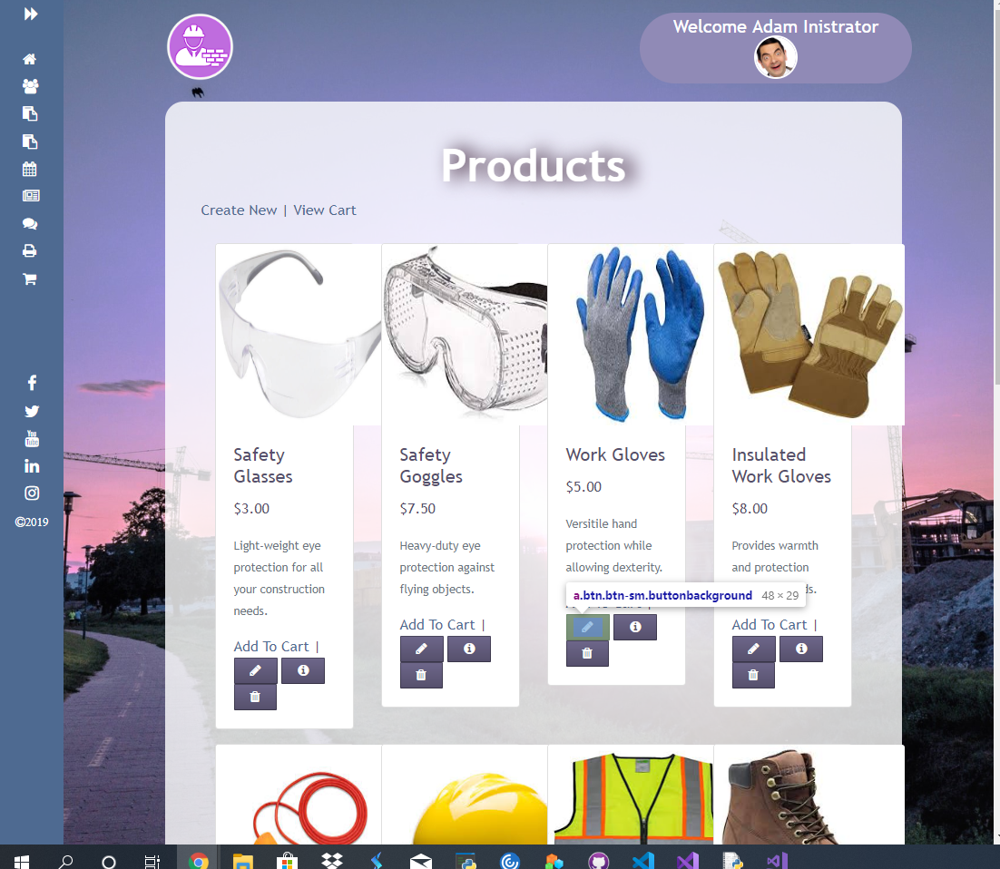
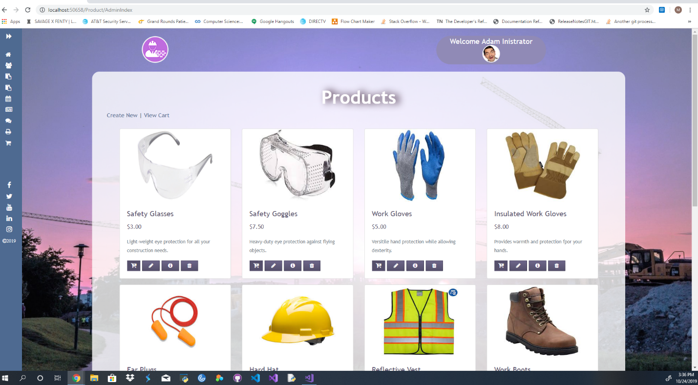
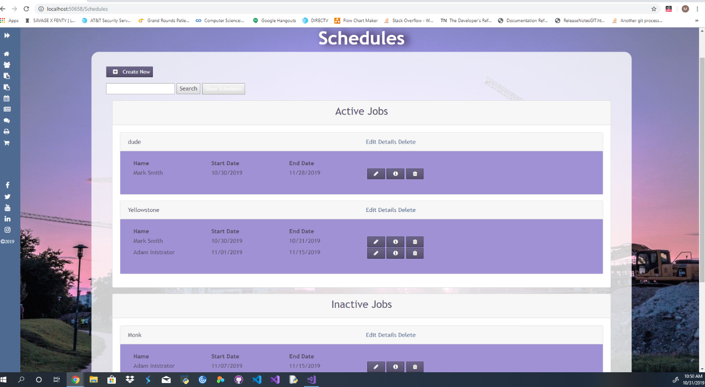

# CSharp-Project-Portfolio

Portfolio for professional development, centered around my C# projects

### Introduction
 
For the two weeks that I worked on the C# live project with The Tech Academy my peers and I were developing a full scale MVC web application in C#.  Everything in this project was already made but updates and bug fixes were necessary.  During this sprint I worked on several stories both front and back end with varying levels of difficulty and was able to make some great improvements to the site.
 
Below are descriptions of the various stories I worked on during my 2-week sprint.
 

#### Front End Stories
 
Product/Edit view page tweak.  This story was about making the edit view for the products fit in with the rest of the site.  I had to add button partials to the page and make sure they were placed correctly this time.  When I started on the project the links were just words and there was no form container for the edit form.  So I set to work creating a container and then making sure I had the correct button partials on the page and that all of the color schemes matched the rest of the website.
 

 
You’ll notice that the styling is different in this image than the rest of the images about this project, that is because I went back after a major site design update to grab this image of the product edit page I made. 
 

 
The next story I worked on was the Products Page Tweak.  In this story I went through and fixed the styling on the products page index for both the admin view and the employee view.  This required me to set up an if statement that if user was in role admin it would load up the admin index view with controls that the employees would not be able to access such as product editing and product deletion. In the photos below you will see how the product page initially looked and how I changed it to make it look cleaner.  The views are from the admin view only, the employee view is the same minus a couple buttons.
 

 

#### Back End Stories

 
Handle “Active” attribute.  For this back-end story, I was tasked with dealing with the active model attribute for our jobs model.  It was a bool, true for active job, false for inactive job.  The issue was that the previous code made it possible for inactive jobs to have schedule items displayed to the employees.  What I did was make it so the job could be toggled active in its information, and it would warn the manager that by toggling a job active that it would now show up for the employee under their jobs worked section.  I also created an inactive jobs section just for the admin/management view so they would be able to see all the jobs and easily switch them between active and inactive.  
 

 
Some changes were also made so the display would be more in line with the rest of our site.
 

 
The next story was for the Time Out Bug Fix.  We had a bug where our session timeout modal would display on the home page even with no-one logged in. I am very proud of the fix I came up with, it was just one line of code.
 

 

#### Other Skills Learned 
 

•	I learned that the fewest lines of code for the fix is often the best approach. 
•	Worked on improving the concise nature of my coding, making it look pretty and compact while maintaining all functionality. 
•	Front end CSS issues with changes are often due to what is cached in the browser and that CTRL F5 will allow you to reload your new CSS. 
•	I developed a deeper understanding of how the whole projects works together; in the python live project I felt a level of disconnect from the rest of the group but with this sprint I always felt like we were working together.  I feel like I gained a wholistic understanding of a full-scale project and felt that I could really see how everything interconnected.   

